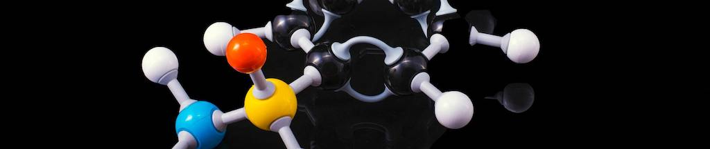
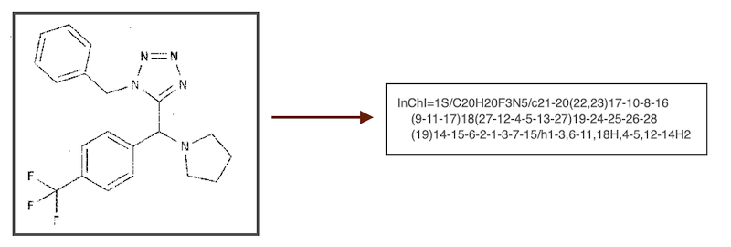

# Solution for Bristol-Myers Squibb – Molecular Translation



Source code of 70th place solution for [Bristol-Myers Squibb – Molecular Translation](https://www.kaggle.com/c/bms-molecular-translation/).

You can read about the solution in detail [here](https://www.kaggle.com/c/bms-molecular-translation/discussion/243868).

## Solution

The main goal is to translate chemical structure images into [InChI](https://en.wikipedia.org/wiki/International_Chemical_Identifier) transcription - machine-readable format. This is image captioning task and solved as CNN+RNN architecture.

<p align="center">
  
</p>

#### Key points:

* EfficientNet as encoder, and LSTM+Attention as decoder.
* Adaptive batchsampler (the higher sample loss, the higher probability to add the sample in a batch).
* Predict [Smile](https://en.wikipedia.org/wiki/Simplified_molecular-input_line-entry_system) notation and than convert it to InChI (Smiles is much more simpler to predict - shorter notation and less token-classes).
* Freeze the encoder and train the lstm-decoder separately.

#### What other experiments could be done:

* More experiments with synthetic images generation.
* Split InChI up to 8 indepenpent string layers (separated by the "/" notation: "/b", "/t", "/m", "/s", etc.) and train the separate models for each layer. Each layer in the InChI describes different information about the molecule, and several models trained on separate inchi-layers can get good results.
* Add rotation transoform to different angles.
* Add beam search.
* Try to replace LSTM to Transformer.

## Quick setup and start

*  Nvidia drivers >= 460, CUDA >= 11.2
*  [Docker](https://www.docker.com/), [nvidia-docker](https://github.com/NVIDIA/nvidia-docker)

The provided [Dockerfile](Dockerfile) is supplied to build an image with CUDA support and cuDNN.

### Preparations

* Clone the repo.
    ```bash
    git clone git@github.com:skalinin/BMS-competition.git
    cd BMS-competition
    ```

* Download and extract [dataset](https://www.kaggle.com/c/bms-molecular-translation/data) to the `data` folder.

* Preprocess dataset csv, generate additional synth images and tokenize data.
    ```bash
    python src/scripts/data_preprocess/prepare_csv/BMS_preprocess.py
    python src/scripts/data_preprocess/prepare_csv/external_synth_data.py
    python src/scripts/data_preprocess/tokenize_csv.py
    ```

### Run

* Train model
  ```bash
  python src/scripts/train.py
  ```

* Make submission csv
  ```bash
  python src/scripts/submission.py \
    --encoder_pretrain /path/to/encoder-weigths \
    --decoder_pretrain /path/to/decoder-weigths
  ```

